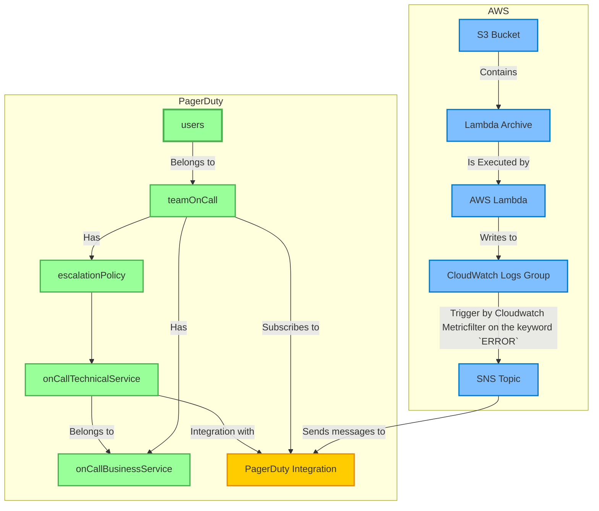

# Install

```
$ npm install
```

# Deploy

```
$ export TF_VAR_PAGERDUTY_TOKEN='PagerDutyコンソールから取得したAPI Key'
$ aws sts get-caller-identity # AWS認証情報が設定されているか確認
$ cdktf deploy pagerduty-cdktf-sample aws-alert-sample-stack

# 途中デプロイの許可の確認があるので、Approve を選択して Enter
```

# Diagram


